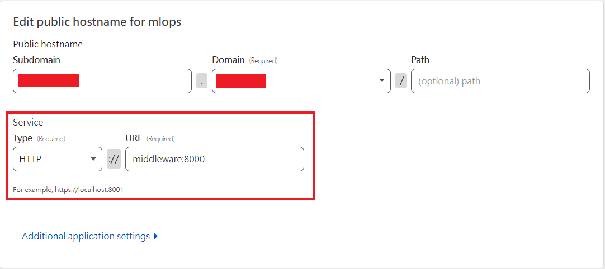

# MLflow tracking server with Cloudflared and MinIO

## Setup

1. Clone this repository.
    ```bash
    git clone https://github.com/twbrandon7/Dockerized-MLflow-cloudflared-MinIO
    cd Dockerized-MLflow-Cloudflared-MinIO
    ```
2. Go to Cloudflare Zero Trust Dashboard, and create a tunnel ([see the documentation](https://developers.cloudflare.com/cloudflare-one/connections/connect-apps/install-and-setup/tunnel-guide/remote/#set-up-a-tunnel-remotely-dashboard-setup)). Once the tunnel created, you should see the following command appeared in the Dashboard:
    ```bash
    cloudflared service install <token>
    ```
    Copy the token, and it will be used later.
3. In Cloudflare Zero Trust Dashboard, configure `Public Hostname` of the tunnel. Add a `Public Hostname Page` and set `Service` to `http://middleware:8000`.
    
4. Create a file called `.env` in the same directory as `README.md`. Several variables should be set in the `.env` file:
    - `TUNNEL_TOKEN`: The token created in step 2.
    - `MINIO_STORAGE_PATH`: The path of a directory to store the file of MinIO.
    - `MINIO_ACCESS_KEY`: The access key of MinIO. This can be used as username to to login MinIO console.
    - `MINIO_SECRET_KEY`: The secret key of MinIO. This can be used as password to login MinIO console.
    - `MLFLOW_STORAGE_PATH`: The path of a directory to store MLflow data.
    - `MLFLOW_S3_BUCKET_MAME`: The bucket name in MinIO server. You can add a bucket by login to MinIO console. To access the console, please expose port `9001` of `minio` container (see [docker-compose.yml](./docker-compose.yml)).
    - `MLFLOW_API_ACCESS_TOKEN`: The token to access MLflow API. You can customize the value.

    For the example of the `.env` file, please see [example.env](./example.env).

## Start MLflow

```bash
docker compose up -d
```
